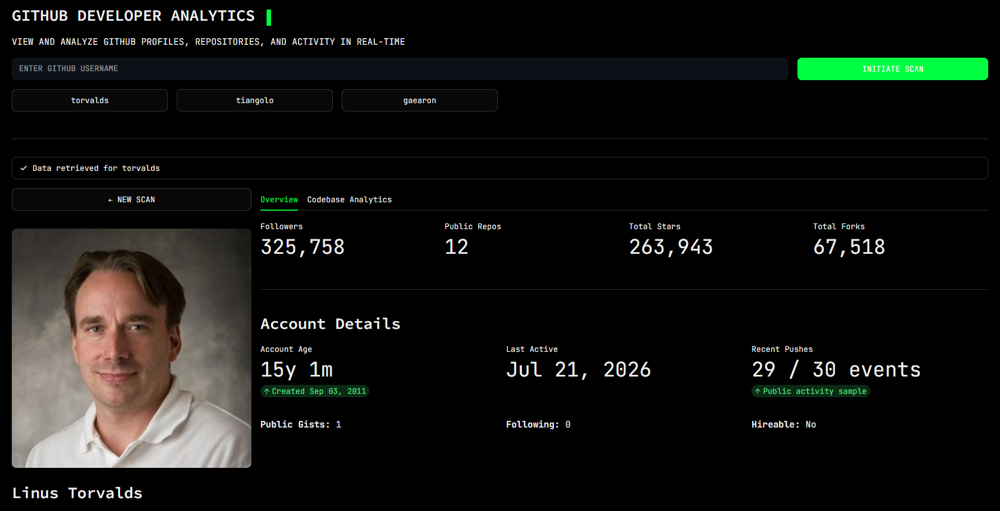

# GitHub Developer Analytics

A fast, interactive dashboard to visualize GitHub profiles and repository data in real-time. Built with Python and Streamlit, featuring automated caching and a clean, responsive design.

## Preview



**🔗 [View Live Application](https://jatinp-gh-analytics.streamlit.app/)**

## Core Features

- **Developer Profiles:** Instantly view user statistics, account age, and network size.
- **Language Analytics:** Interactive charts visualizing the primary programming languages used across public repositories.
- **Activity Tracking:** Monitor recent updates, repository counts, and commit history.

## Technical Overview

The application interfaces directly with the GitHub REST API, utilizing in-memory caching and graceful error handling to manage rate limits efficiently. It is built on a modular architecture that separates data fetching, processing, and the user interface, and is backed by a continuous integration pipeline (GitHub Actions) for automated testing.

## UI & Design

- **Clean, Focused Design:** A custom CSS theme provides a distraction-free, highly readable interface.
- **Fast Loading:** The application relies on system-default fonts to minimize loading times and reduce external dependencies.

## Tech Stack

- **Language:** Python
- **Framework:** Streamlit
- **Data & Visualization:** Pandas, Altair
- **Testing & CI:** Pytest, GitHub Actions
- **Network:** Requests (GitHub REST API)

## Running it Locally

1. Ensure you have Python installed on your system.

2. Clone the repository:

   ```bash
   git clone https://github.com/jatinpanigrahy/github-dev-analytics.git
   cd github-dev-analytics
   ```

3. Activate your virtual environment (e.g., `.venv`):

   ```bash
   python -m venv .venv
   # Windows (PowerShell):
   .\.venv\Scripts\Activate.ps1
   # macOS/Linux:
   source .venv/bin/activate
   ```

4. Install the required dependencies:

   ```bash
   pip install -r requirements.txt
   ```

5. Run tests:

   ```bash
   pytest
   ```

6. Launch the application:

   ```bash
   streamlit run app.py
   ```

## Deployment

This application is deployed and hosted via Streamlit Community Cloud.

**Live Application:** <https://jatinp-gh-analytics.streamlit.app/>
