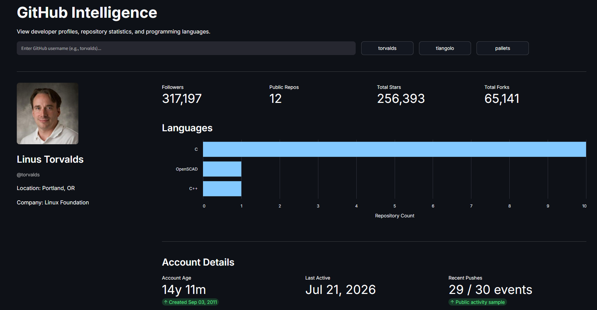

# GitHub Intelligence Dashboard

A lightweight, efficient dashboard for analyzing public GitHub profiles. It's designed to provide instant insights into developer activity, repository structures, and tech stacks.

## Preview

> 

**🔗 [View Live Application](https://jatinp-github-inteldashboard.streamlit.app/)**

## Core Features

- **Profile Overview:** Summarizes user identity, account age, and social reach.
- **Codebase Analysis:** Visualizes language distribution across repositories.
- **Activity Metrics:** Tracks repository updates and recent public events.
- **Data Retrieval:** Interfaces directly with the GitHub REST API.
- **Efficiency:** Implements server-side caching (@st.cache_data) to optimize API consumption and performance.
## Tech Stack

- **Python**
- **Streamlit** 
- **Requests, Pandas & Altair**

## Deployment
This application is deployed via Streamlit Community Cloud.

**Live Application:** https://jatinp-github-inteldashboard.streamlit.app/